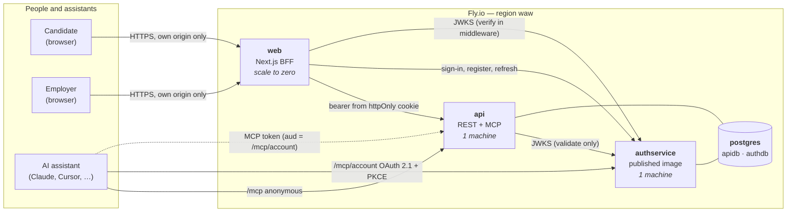

<a name="readme-top"></a>

# work-in-poland

[](https://github.com/konradcinkusz "Ask me anything")
[](https://github.com/konradcinkusz/work-in-poland/blob/main/LICENSE "GitHub license")
[](https://github.com/konradcinkusz/work-in-poland/commits/main "Maintained")
[](https://github.com/konradcinkusz/work-in-poland/branches "GitHub branches")
[](https://github.com/konradcinkusz/work-in-poland/commits/main "GitHub commits")
[](https://github.com/konradcinkusz/work-in-poland/issues "GitHub issues")
[](https://github.com/konradcinkusz/work-in-poland/pulls "GitHub pull requests")

[](https://github.com/konradcinkusz/work-in-poland/actions/workflows/ci.yml "CI")
[](https://github.com/konradcinkusz/work-in-poland/actions/workflows/codeql.yml "CodeQL")
[](https://github.com/konradcinkusz/work-in-poland/actions/workflows/secret-scan.yml "Secret scan")

A job board for the **Polish market** that an AI assistant can use directly. Search jobs, compare
salaries (UoP and B2B kept apart, gross and net never mixed), track your applications — and, as an
employer, post a job by describing it. Modelled on [Himalayas](https://github.com/konradcinkusz/himalayas-mcp)
(an MCP-first remote job board), narrowed to Poland, with the parts Poland changes: mandatory salary
ranges, contract type as its own dimension, a Polish interface, and no CV storage.

*Po polsku:* serwis z ofertami pracy dla polskiego rynku, który asystent AI (Claude, Cursor…) potrafi
obsłużyć wprost — wyszukiwanie ofert, widełki UoP/B2B, śledzenie aplikacji, a dla firm publikowanie ofert
w rozmowie. Aplikowanie to przekierowanie na stronę pracodawcy; żadne CV nie jest przechowywane.

## What this is — and what it is not yet

**It is a working, deployable platform**: a REST API, an MCP server (anonymous reads and OAuth for
accounts), a Polish Next.js web app, identity through [authservice](https://github.com/konradcinkusz/authservice),
tests at every layer, and a tag-driven deployment to Fly.io.

**It is not a proven market.** The analysis this repository follows
([`docs/analysis/HIMALAYAS-DLA-POLSKI.md`](docs/analysis/HIMALAYAS-DLA-POLSKI.md)) concludes that a 1:1
Himalayas clone for Poland is a bad bet, that a niche board or an MCP layer for existing portals are
only worth building *after* pre-sales, and that its first-things-first list is sales conversations, not
code. The platform deliberately keeps every option open ([ADR 0010](docs/adr/0010-product-scope.md));
choosing between them is still to be done, and
[`docs/analysis/NASTEPNE-KROKI.md`](docs/analysis/NASTEPNE-KROKI.md) turns that list into messages to send.
A one-sided free marketplace is a hypothesis, not a business.

### How *not* to use it

- **Not a scraper.** Listings come from the employer who submits them (or a partner acting for its own
  employers). Nothing here pulls ads from other portals, and nothing should.
- **Not a CV store.** Applying is a redirect to the employer's own page
  ([ADR 0004](docs/adr/0004-apply-by-redirect.md)). A "send my CV to companies" feature is a legal
  question (employment-agency register, RODO) before it is a ticket.
- **Not legal advice.** The terms, privacy and cookie pages are drafts that say so on their face. The
  salary-range rule is a product rule stricter than the statute
  ([ADR 0007](docs/adr/0007-mandatory-salary-ranges.md)), not a statement of what the statute requires.
- **Not an identity provider.** No user store, no token minting, no signing key lives here.

## Quick start

```bash
./scripts/setup.sh                              # prerequisites, deps, git hook, dev signing key  (Windows: .\scripts\setup.ps1)
dotnet run --project src/WorkInPoland.AppHost   # Postgres + authservice + API + web; the Aspire dashboard prints the URLs
```

With **no cloud credentials** this is a working system with reduced features (P8): no email delivery
(authservice only logs the messages) and no social login. `GET /health` on the API says exactly what is
degraded. Without Aspire, the same stack in plain containers:

```bash
scripts/dev-stack.sh up        # web http://localhost:3000 · api http://localhost:8081 · authservice http://localhost:8080
scripts/dev-stack.sh down
```

Demo listings (about fourteen fictional Polish ones) are seeded when `Seed__Demo=true`; the AppHost and
the stack script set it. **The companies and listings in the seed are invented.**

### Use it from an AI assistant

```bash
claude mcp add --transport http work-in-poland https://<api host>/mcp
```

Anonymous and read-only. `/mcp/account` adds your tracker and the employer tools behind OAuth.
Everything — tools, scopes, connecting Claude, registering the OAuth client — is in
[`docs/MCP.md`](docs/MCP.md).

## How it fits together



The browser only ever talks to the web app's own origin; its server side holds the tokens in `httpOnly`
cookies and proxies to the API. The API validates RS256 tokens against authservice's JWKS and holds no
key. The same diagram is the single source `docs/diagrams/a1-system-context.mmd`.

| Project | Role | Direct dependencies |
|---|---|---|
| `src/WorkInPoland.AppHost` | P1 — the composition root, **development only** (Postgres, authservice, API, web). Not the production topology | @APPHOST_DEPS@ |
| `src/WorkInPoland.ServiceDefaults` | P2 — the shared kernel: telemetry, health, discovery, resilience, JWT validation, CORS, OpenAPI, database provider, rate limiting, validation filter. Plumbing only; capped at 800 lines by CI | @KERNEL_DEPS@ |
| `src/WorkInPoland.Contracts` | DTOs and constants that cross the HTTP boundary | @CONTRACTS_DEPS@ |
| `src/WorkInPoland.Api` | The one service. Owns `apidb`; REST (`/api/v1`), the MCP adapter (`/mcp`, `/mcp/account`), migrations, listing expiry, demo seeding | @API_DEPS@ |
| `web/app` | The Next.js product surface and BFF (Polish UI) | @WEB_DEPS@ |
| `tests/WorkInPoland.Api.Tests` | xUnit: validation, search, salary maths, lifecycle, auth, MCP through a real client, architecture guards, migrations on a real Postgres | @TESTS_DEPS@ |
| `tests/e2e` | Playwright against the real stack (Postgres + authservice + API + web), wired to CI | @E2E_DEPS@ |

*Dependency counts are direct package references — a number that goes up in a diff is a question
somebody can ask* (REPO-BASELINE §4b). Identity is **not** a project here: authservice is run from its
published image.

## Documentation

| | |
|---|---|
| [`docs/api/API.md`](docs/api/API.md) | The contract between the API, the web BFF and MCP clients. Change it with the code |
| [`docs/MCP.md`](docs/MCP.md) | Using and operating the MCP endpoints |
| [`docs/architecture/00-ARCHITECTURE.md`](docs/architecture/00-ARCHITECTURE.md) | This repository measured against the estate's constitution; the deviation register |
| [`docs/adr/`](docs/adr/) | Every decision a reader might think was inevitable, each with the trigger that reopens it |
| [`docs/ux/UI-UX.md`](docs/ux/UI-UX.md) | Screens and flows as built, and the ranked backlog |
| [`docs/analysis/`](docs/analysis/) | The market analysis this follows, and the next steps it calls for (in Polish) |
| [`flyio/`](flyio/) | One `fly.toml` per app, `SECRETS.md`, `INFRASTRUCTURE-ANALYSIS.md` (topology and cost) |
| [`scripts/README.md`](scripts/README.md) | Every script and variable by tier; troubleshooting keyed on the literal error text |
| [`AGENTS.md`](AGENTS.md) | How an agent works here |

The architecture follows [`konradcinkusz/architecture-standards`](https://github.com/konradcinkusz/architecture-standards)
(P1–P15); `.claude/settings.json` declares that adoption instead of leaving it to memory.

## Checks

```bash
dotnet build WorkInPoland.sln                   # warnings are errors; a vulnerable package fails the restore
dotnet test                                     # set WIP_TEST_POSTGRES to also apply the migrations to a real Postgres
scripts/check-kernel-size.sh                    # the kernel stays a kernel (P2)
pnpm install && pnpm lint && pnpm typecheck && pnpm test && pnpm build
scripts/dev-stack.sh e2e                        # the browser suite against the real stack
node scripts/check-links.mjs                    # every relative markdown link resolves
scripts/scan-secrets.sh                         # what the pre-commit hook and the CI job run
```

## Deploying

Tag-driven, to Fly.io: `git tag v0.1.0 && git push --tags`. The first tag provisions the whole estate from
cold (every missing app and the database volume are created by the workflow), in the order
postgres → authservice → api → web, and ends with a public-URL smoke test. The one-time human setup is
three lines in [`flyio/SECRETS.md`](flyio/SECRETS.md). Nothing is deployed from a laptop.

## License

[MIT](LICENSE).

<p align="right">(<a href="#readme-top">back to top</a>)</p>
